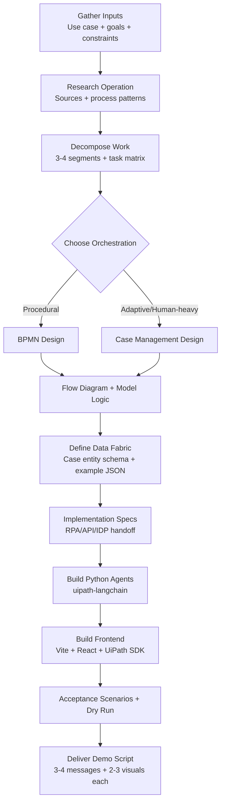

# UiPath Demo Builder Context Harness

This repository is a demo-builder context harness for coding agents to accelerate demo builds.

## Quick Start

```bash
git clone <your-repo-url>
cd demo-builder
```

## Prerequisites

This harness references UiPath Skills that should be installed before use.

- UiPath TypeScript SDK repository (skills references)
- https://github.com/jms-dcksn/uipath-codex-skills

## Example User Prompt

```text
Build a new demo for "Commercial Insurance Claims Triage".
Business goal: Reduce time to first decision by 40% while improving consistency of risk assessment.
Industry/domain: Insurance / Claims Operations.
Requirements: Use UiPath Maestro, Data Fabric, at least 2 Python agents, and a React frontend with dashboard + case detail pages.
Implementation rule: each identified agent must be scaffolded independently with `uipath new <agent-name>` (no multi-role prompt multiplexing in one runtime).
Known systems: Policy admin API, document inbox, adjuster notes in SharePoint.
Constraints: Demo-ready in 2 weeks, show happy path and exception path, include a final suggested demo script.
```

## Agent Plan Flow


