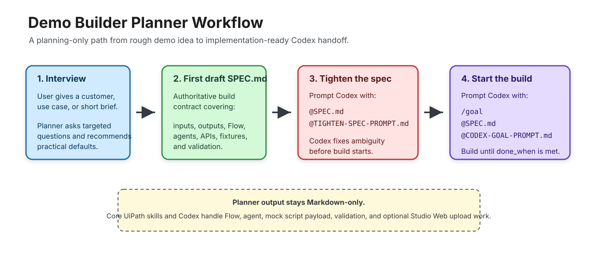

# UiPath Demo Builder Planner

`demo-builder-planner` is a skill for planning demo-grade UiPath Maestro Flow builds. It turns a customer name, use case, or short brief into a precise `SPEC.md`, a short spec-tightening prompt, and a structured `/goal` prompt for long-running demo builds.

The skill plans the demo. It does not build or upload UiPath artifacts by itself. The resulting artifacts are meant to be handed to a coding agent with the core UiPath skills installed.

## Install as a Claude Code Plugin

### Option 1: Install from GitHub (recommended)

```bash
claude plugin install https://github.com/jms-dcksn/uipath-demo-builder
```

Restart Claude Code after the install finishes.

### Option 2: Install manually

Clone or download the repo, then copy the skill directory into Claude Code's skills folder:

```bash
cp -r skills/demo-builder-planner ~/.claude/skills/
```

Restart Claude Code after copying.

### Option 3: Install from local clone

From the root of this repo:

```bash
claude plugin install .
```

## Install as a Codex Skill

### Option A: Ask Codex to install it

Open Codex and paste:

```text
Install the Codex skill at https://github.com/jms-dcksn/uipath-demo-builder/tree/main/skills/demo-builder-planner
```

Restart Codex after the install finishes.

### Option B: Install from terminal

```bash
python3 ~/.codex/skills/.system/skill-installer/scripts/install-skill-from-github.py --repo jms-dcksn/uipath-demo-builder --path skills/demo-builder-planner
```

Restart Codex after the install finishes.

To update later, delete the old installed skill folder and re-run the same install option.

## Companion Skills

Install the core UiPath skills too. The planner depends on them for product-specific build guidance:

- `uipath-maestro-flow`
- `uipath-agents`
- `uipath-platform`

## How To Use

Start a conversation and describe the demo you want:

```text
Plan a UiPath Maestro Flow demo for commercial insurance claims triage.
```

Minimum input:

- Customer or account name
- Use case title
- Short use-case brief

Better input:

- Industry or domain
- Known systems or connectors
- Must-show UiPath capabilities
- Happy path and one exception path
- Preferred agent mode, if known
- Studio Web upload expectation, if known

The planner writes:

- `SPEC.md`
- `TIGHTEN-SPEC-PROMPT.md`
- `CODEX-GOAL-PROMPT.md`
- Optional supporting files under `demo-build-plan/` for larger demos

## Workflow



After the interview, the planner creates a first draft `SPEC.md`. Then ask the agent to tighten the spec:

```text
@SPEC.md
@TIGHTEN-SPEC-PROMPT.md
```

When the spec is ready, start the implementation handoff:

```text
/goal
@SPEC.md
@CODEX-GOAL-PROMPT.md
```

## Repository Layout

```text
package.json                                   # Claude Code plugin manifest
skills/demo-builder-planner/                   # Skill definition
skills/demo-builder-planner/SKILL.md
skills/demo-builder-planner/references/spec-quality-checklist.md
skills/demo-builder-planner/references/goal-prompt-template.md
docs/planner-workflow.excalidraw
docs/planner-workflow.svg
```
