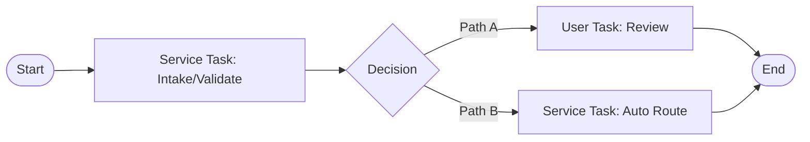

# Maestro BPMN Design Template

## 1) Process Definition

- Process name:
- Process objective:
- Start event type:
- End event outcomes:

## 2) BPMN Reference Comparison

Use `context/01-use-case-agentic-logic/example-bpmn.bpmn` as the baseline for demo-quality structure.

- Reference file reviewed:
- Structural patterns reused (lanes, gateways, boundary events, task sequencing):
- Structural differences from reference and why:
- Import constraints for target proprietary web editor:

## 3) Mermaid Representation (Required For BPMN)

Create a Mermaid flow that mirrors the intended BPMN skeleton.

- Mermaid reviewed against task matrix:
- Mermaid reviewed against reference BPMN patterns:

## 4) BPMN Skeleton Artifact (Importable)

- Output BPMN file path:
- Target import environment/tool:
- Skeleton scope (what is intentionally left as placeholder):
- Confirmed valid BPMN XML:
- Confirmed import success:

Import readiness checklist:

- Contains at least one start event and one end event.
- All tasks/gateways are connected by sequence flows.
- Lane set and participants are defined when needed.
- Uses placeholder task labels where implementation wiring is deferred.
- Does not require full automation/RPA/API/Agent binding to import.

## 5) Lanes And Participants

| Lane | Participant Type | Responsibilities |
|---|---|---|
| Automation lane | System | Routing, enrichment, policy checks |

## 6) Task Catalog

| Task ID | Task Name | Type (Service/User) | Execution Type | Component | Input | Output |
|---|---|---|---|---|---|---|
| T-001 | Validate case | Service | Automated | AI Agent | Case payload | Validation result |

## 7) Gateways And Routing Logic

| Gateway ID | Decision Condition | True Path | False Path |
|---|---|---|---|
| G-001 | High risk? | Route to senior reviewer | Continue auto path |

## 8) Timers And SLAs

| Timer | Duration | Trigger Point | Action On Breach |
|---|---|---|---|
| Review SLA | 24h | User task assigned | Escalate to supervisor |

## 9) Error And Recovery Paths

- Technical failure handling:
- Business rule failure handling:
- Compensation steps:

## 10) Data Touchpoints

- Case entity fields read:
- Case entity fields written:
- External systems called:

## 11) Task To Component Contracts

| Task ID | Contract Artifact | Owner | Notes |
|---|---|---|---|
| T-001 | Agent spec | AI Team | Buildable directly with Python SDK |
| T-002 | RPA spec | Automation Team | Implemented in proprietary tooling |
| T-003 | API spec | Integration Team | Contract-first handoff |
| T-004 | IDP spec | Document AI Team | Confidence thresholds required |

## 12) Build Checklist

- BPMN model drafted:
- BPMN compared to `example-bpmn.bpmn` baseline:
- Mermaid flow drafted to mirror BPMN structure:
- Importable BPMN skeleton artifact generated:
- All user tasks linked to UI screens:
- All service tasks linked to APIs/services:
- Proprietary component specs written for every non-buildable component:
- All paths covered by test scenarios:
