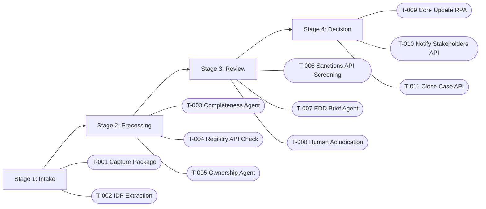

# Case Management Design - KYC Onboarding (Recommended)

Use this model as the primary implementation approach.

## 1) Case Type Definition

- Case type name: `KycOnboardingCase`
- Business objective: Manage adaptive KYC onboarding from submission through accountable decision.
- Primary case owner role: KYC Analyst

## 2) Lifecycle Model

| Stage | Entry Criteria | Typical Tasks | Exit Criteria |
|---|---|---|---|
| Intake | Case created via application submission | T-001, T-002 | Structured intake package available |
| Processing | Intake complete | T-003, T-004, T-005 | Profile validated and enriched |
| Review | Processing complete | T-006, T-007, T-008 | Reviewer decision captured |
| Decision | Review decision submitted | T-009, T-010, T-011 | Case terminal status and closure |

## 3) Milestones

| Milestone | Business Meaning | Trigger |
|---|---|---|
| M-001 IntakeReady | Case has required source data | T-002 completed |
| M-002 RiskPrepared | Automated checks are complete | T-007 completed |
| M-003 DecisionMade | Accountable human decision recorded | T-008 completed |
| M-004 CaseClosed | All finalization activities done | T-011 completed |

## 4) Task Templates

| Task Template | Assigned Role | Due In | Completion Rule |
|---|---|---|---|
| Provide missing information | Operations | 1 business day | Missing fields collected and attached |
| Adjudicate screening result | Compliance Reviewer | 8 business hours | Decision + reason code + comment |
| Resolve integration exception | Operations Admin | 4 business hours | Retry success or documented workaround |

## 5) Escalation Model

- SLA thresholds:
  - Review stage warning at 6 business hours
  - Review stage breach at 8 business hours
- Escalation recipients: Senior compliance reviewer, onboarding operations manager.
- Escalation actions: Priority uplift, reassignment, supervisor notification.

## 6) Collaboration And Notes

- Required comments: Mandatory on all approvals/rejections and escalations.
- Attachments required: Evidence artifacts for screening dispositions.
- Audit trail expectations: Every task state change and decision captured with actor identity.

## 7) Exceptions

- Missing data exception: Move to `PendingInfo` and spawn follow-up task.
- Policy conflict exception: Route to compliance reviewer with flagged fields.
- External dependency exception: Ops exception task with retry and fallback plan.

## 8) Mermaid Stage/Task Blueprint

## 9) Proprietary Model Handoff Notes

- Stage names to implement: Intake, Processing, Review, Decision.
- Task templates to implement: Missing information, screening adjudication, integration exception.
- Data fields required by each task: `caseid`, `status`, `riskscore`, `screeningsummary`, `decisionreasoncode`.
- SLA/escalation settings: Configure warning/breach timers per stage.
- Manual configuration checklist: roles, permissions, assignment rules, escalation recipients.
