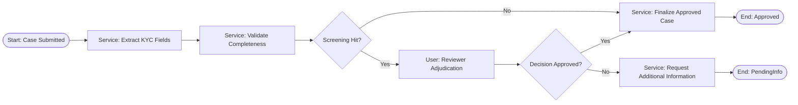

# Maestro BPMN Design - KYC Onboarding (Procedural Variant)

## 1) Process Definition

- Process name: `KYC_Onboarding_Procedural_Skeleton`
- Process objective: Provide a valid BPMN procedural skeleton for teams that prefer strict flow sequencing, while keeping Case Management as the primary model.
- Start event type: New case submission event.
- End event outcomes: Approved, PendingInfo.

## 2) BPMN Reference Comparison

Use `context/01-use-case-agentic-logic/example-bpmn.bpmn` as the baseline for demo-quality structure.

- Reference file reviewed: Yes (`context/01-use-case-agentic-logic/example-bpmn.bpmn`).
- Structural patterns reused (lanes, gateways, boundary events, task sequencing): Start/service-task chain, decision gateways, human review step, explicit end states.
- Structural differences from reference and why: This example intentionally removes platform-specific activity bindings and keeps only import-safe skeleton elements.
- Import constraints for target proprietary web editor: BPMN 2.0-compliant XML with connected sequence flows and clear node labels.

## 3) Mermaid Representation (Required For BPMN)

Create a Mermaid flow that mirrors the intended BPMN skeleton.

- Mermaid reviewed against task matrix: Yes.
- Mermaid reviewed against reference BPMN patterns: Yes.

## 4) BPMN Skeleton Artifact (Importable)

- Output BPMN file path: `context/examples/kyc-us-commercial-banking/01-use-case-agentic-logic/kyc-onboarding-procedural-skeleton.bpmn`
- Target import environment/tool: UiPath proprietary web BPMN editor.
- Skeleton scope (what is intentionally left as placeholder): Service/user task labels are defined; automation/API/RPA/agent bindings are intentionally deferred.
- Confirmed valid BPMN XML: Yes (well-formed BPMN 2.0 XML skeleton).
- Confirmed import success: Pending target-tenant validation during implementation.

Import readiness checklist:

- Contains at least one start event and one end event.
- All tasks/gateways are connected by sequence flows.
- Lane set and participants are defined where needed.
- Uses placeholder task labels where implementation wiring is deferred.
- Does not require full automation/RPA/API/Agent binding to import.

## 5) Lanes And Participants

| Lane | Participant Type | Responsibilities |
|---|---|---|
| Automation Lane | System | Extraction, validation, routing, finalization updates |
| Analyst Lane | Human | Manual adjudication and decision input |

## 6) Task Catalog

| Task ID | Task Name | Type (Service/User) | Execution Type | Component | Input | Output |
|---|---|---|---|---|---|---|
| T-002 | Extract KYC fields | Service | Automated | IDP | Uploaded docs | Extracted fields |
| T-003 | Validate completeness | Service | Automated | AI Agent | Extracted fields | Pass/fail + missing list |
| T-006 | Sanctions screening | Service | Automated | API | Customer + owner parties | Hit/no-hit results |
| T-008 | Reviewer adjudication | User | Human Task | Case task | Full case packet | Decision + reason |
| T-009 | Finalize approved case | Service | Automated | API/RPA placeholder | Approved payload | Finalization status |
| T-010 | Request additional info | Service | Automated | API placeholder | Decision payload | PendingInfo notification |

## 7) Gateways And Routing Logic

| Gateway ID | Decision Condition | True Path | False Path |
|---|---|---|---|
| G-001 | Screening hit found? | Route to reviewer adjudication | Route to auto finalization |
| G-002 | Decision approved? | Finalize approved case | Request additional info |

## 8) Timers And SLAs

| Timer | Duration | Trigger Point | Action On Breach |
|---|---|---|---|
| TMR-REVIEW | 8 business hours | T-008 assigned | Escalate to senior reviewer |

## 9) Error And Recovery Paths

- Technical failure handling: Retry transient integration errors before exception queue.
- Business rule failure handling: Route case to analyst with explicit failure reasons.
- Compensation steps: If finalization partially fails, keep status in `InReview` and create exception task.

## 10) Data Touchpoints

- Case entity fields read: `status`, `riskscore`, `currentsegmentid`, `screeningsummary`.
- Case entity fields written: `status`, `decision`, `decisionreasoncode`, `assignedto`, `updatedat`.
- External systems called: sanctions screening API, registry API, notification API, core banking (RPA fallback).

## 11) Task To Component Contracts

| Task ID | Contract Artifact | Owner | Notes |
|---|---|---|---|
| T-003 | Agent build spec | AI Team | `uipath-langchain` `create_agent` pattern |
| T-006 | API contract spec | Integration Team | Include list version + timestamp response fields |
| T-009 | RPA/API interaction spec | Automation Team | Required if no direct core API |
| T-002 | IDP extraction spec | Document AI Team | Confidence threshold and fallback rules |

## 12) Build Checklist

- BPMN model drafted: Yes.
- BPMN compared to `example-bpmn.bpmn` baseline: Yes.
- Mermaid flow drafted to mirror BPMN structure: Yes.
- Importable BPMN skeleton artifact generated: Yes.
- All user tasks linked to UI screens: Yes (instance detail route).
- All service tasks linked to APIs/services: Placeholder-level mapping complete.
- Proprietary component specs written for every non-buildable component: Yes.
- All paths covered by test scenarios: Yes (approved and pending-info paths).
