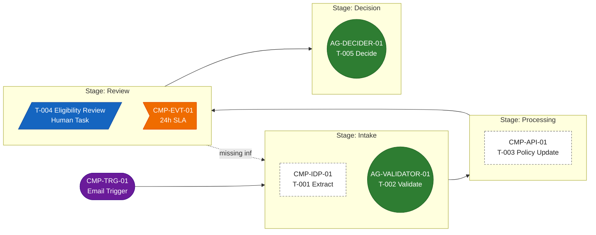

# Case Management Design Template

Demo-grade blueprint. Fill this, get user approval on the Mermaid diagram, then synthesize `sdd.md` for the production `uipath-case-management` skill.

**Before filling section 5, read `references/stub-contract-rules.md`.** Every non-agent, non-human task (plus the trigger and any intermediate events) must have a stub contract with hardcoded demo I/O — this is the handoff the user needs to mock up pass-through RPA / API / IDP workflows.

## 1) Case Type Definition

- Case type name:
- Business objective:
- Primary case owner role:
- Case entity (Data Fabric): <link to case-entity.schema.json>

## 2) Trigger

Exactly one trigger. This is how a case starts.

| Field | Value |
|---|---|
| Component ID | CMP-TRG-01 |
| Type | `Email \| Form \| Webhook \| Schedule \| Queue Item \| Manual` |
| Payload schema | field · type (e.g., `submissionId:string`, `applicantName:string`, `documents:array<url>`) |
| Demo payload — happy | `{ ... hardcoded ... }` |
| Demo payload — exception | `{ ... hardcoded ... }` |
| Mock hint | One sentence. |
| Real-build note | One sentence. |

## 3) Stages

| Stage | Entry Criteria | Exit Criteria |
|---|---|---|
| Intake | Case created by trigger | Required fields captured |
| Processing |  |  |
| Review |  |  |
| Decision |  |  |

Keep to **3-5 stages**. Merge if research pushes higher.

## 4) Tasks per Stage

| Stage | Task ID | Task Name | Execution Type | Owner (AG-* / CMP-* / role) | Notes |
|---|---|---|---|---|---|
| Intake | T-001 | Extract submission data | IDP | CMP-IDP-01 | mock |
| Intake | T-002 | Validate extracted data | AI Agent | AG-VALIDATOR-01 | real |
| Processing | T-003 | Update policy system | API | CMP-API-01 | mock |
| Review | T-004 | Eligibility review | Human Task | role:`reviewer` | form |
| Decision | T-005 | Final decision | AI Agent | AG-DECIDER-01 | real |

Execution types: see `skills/demo-builder-planner/references/mapping-conventions.md` §5.

## 5) Non-Agent Stub Contracts

One row per `RPA` / `API` / `IDP` task. Follows `references/stub-contract-rules.md`.

| Component ID | Backs task | Stage | Type | Inputs (field:type ← source) | Outputs (field:type → case.field) | Demo — happy (in → out) | Demo — exception (in → out) | Mock hint | Real-build note |
|---|---|---|---|---|---|---|---|---|---|
| CMP-IDP-01 | T-001 | Intake | IDP | `documents:array<url>` ← trigger.documents | `applicantName:string → case.applicantName`, `amount:number → case.amount` | `{docs:[...]}` → `{applicantName:'Acme Inc', amount:500000}` | `{docs:[...]}` → `{applicantName:null, amount:null}` (low-confidence) | return hardcoded fields; ignore URLs | real IDP project extracts from PDF with confidence threshold 0.92 |
| CMP-API-01 | T-003 | Processing | API | `applicantId:string ← case.applicantId` | `policyStatus:string → case.policyStatus` | `{id:'A-1'}` → `{status:'ACTIVE'}` | `{id:'A-1'}` → `{status:'LAPSED'}` | pass-through lookup table, 2 rows | REST GET /policies/{id}, OAuth |

## 6) Intermediate Events

Only fill if the flow actually waits mid-stage. Skip otherwise.

| Component ID | Stage | Type | Wait condition | Demo behavior | Real-build note |
|---|---|---|---|---|---|
| CMP-EVT-01 | Review | Timer | 24h SLA | fires after 5s in demo | boundary timer on Review stage |

## 7) Transitions

| From Stage | To Stage | Condition (rule ID if applicable) |
|---|---|---|
| Intake | Processing | All required fields captured (R-001) |
| Review | Decision | Reviewer approved |
| Review | Intake | Missing info — return (exception) |

## 8) Mermaid Stage/Task Blueprint

Agents = solid filled nodes. Stubs = dashed nodes. Trigger + events = distinct shapes.

## 9) Handoff Summary (auto-generated from sections 2 + 5 + 6)

List of items the user must eventually build for real. The `case-designer` sub-agent returns this list in its report.

- `CMP-TRG-01` — <one line>
- `CMP-IDP-01` — <one line>
- `CMP-API-01` — <one line>
- `CMP-EVT-01` — <one line>

Each row's full I/O + mock hint + real-build note lives in sections 2, 5, 6.
